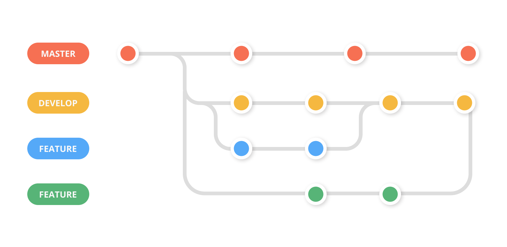

## <a name="" >Nội dung chính</a>

[1-tải-xuống-và-đẩy-lên-nội-dung-trên-github](#1)

[2-nhánh-(branch)](#2)

[tài-liệu-tham-khảo](#3)

## <a name="1" >1. Tải xuống và đẩy lên nội dung trên github</a>

Cài đặt bất kỳ công cụ nào hỗ trợ làm việc với Github, có thể sử dụng giao diện hoặc CMD. Để nhanh gọn, trong bài này chủ yếu dùng CMD.

Cài đặt git thành công, để kiểm tra phiên bản mở cmd lên và nhập lệnh:

```sh
git --version
```

Kết quả trả về tương tự:

```sh
C:\Users\cas>git --version
git version 2.38.1.windows.1
```


Để clone 1 repo từ github về:

```sh
git clone <đường dẫn đến repo>
```

- Trong cmd, đang đứng tại đâu thì git sẽ clone repo về thư mục đó

Để tạo 1 repo trên máy cá nhân:

```sh
git init
```

- đang đứng tại đâu git sẽ tạo 1 repo mới tại thư mục đó.

Để đưa code lên github:

```sh
git add .

git commit -m "điền nội dung commit vào đây"

git push origin main
```

- Trong đó:
  - git add . : thêm toàn bộ thư mục hiện có
  - git commit -m "" : nội dung cho công việc bạn vừa làm mà muốn đưa lên git (bắt buộc phải có)
  - git push origin main : đẩy nội dung đã thay đổi lên github


Xem chi tiết hơn [tại đây](https://vn.got-it.ai/blog/huong-dan-chi-tiet-cach-push-code-len-git)

## <a name="2" >2. Nhánh (branch)</a>

Hiểu cơ bản thì khi tạo bất kỳ dự án nào thì ta cũng sẽ có một nhánh chính (phần gốc rễ của dự án). Khi nó đã đạt được độ ổn định nhất định, để tránh gây tổn thất không đáng có hoặc để phân phối cho các nhà phát triển khác, thì ta buộc phải sinh ra những nhánh con để cung cấp theo yêu cầu đó.

Trên github cũng vậy, khi tạo mới bất kỳ một dự án nào nó sẽ mặc định là nhánh chính (main - ngày trước là master). Từ `main` này ta có thể tạo ra nhiều nhánh con để phát triển. Các nhánh con này sẽ sở hữu toàn bộ các thông tin từ nhánh chính. Và có phát triển độc lập, bất kỳ thay đổi nào cũng không ảnh hưởng đến nhánh chính ban đầu, kể cả có thay đổi các file ban đầu của nhánh chính.

Khi các nhánh con được phát triển ổn định có thể yêu cầu áp dụng những thay đổi đó cho nhánh chính, khi được chấp nhận thì các thay đổi sẽ được github ghi nào nhánh chính. Nhánh chính có thể chấp nhận thay đổi từ nhiều nhánh con, nhưng tại 1 thời điểm thì có thể áp dụng 1 thay đổi nhất định.
<p align="center">
 
</p>
Dùng CLI để thao tác với branch cơ bản như sau (bắt buộc phải đang đứng tại repo mà mới clone - hay tạo mới):

- Tạo mới nhánh con:

```sh
git branch <branch-name>
```

- Di chuyển giữa các nhánh:

```sh
git checkout <branch-name>
```

- Kiểm tra số lượng nhánh hiện có của repo:

```sh
git branch
```

- Tạo mới nhánh và di chuyển luôn sang nhánh vừa tạo

```sh
 git checkout -b <branch-name>
```

- Khi tạo mới nhánh trên máy cá nhân thì nó sẽ không tự đồng bộ trên github, chạy câu lệnh sau để được đồng bộ:

```sh
git push -u <remote> <branch-name>
```

>[Delete branch](https://stackoverflow.com/questions/2003505/how-do-i-delete-a-git-branch-locally-and-remotely)

- Để xoá branch thì có 2 bước:
  - B1: xoá trên github: `git push -d <remote> <branch-name>`
  - B2: xoá tại máy local, nhớ phải đang đứng tại branch khác thì mới xoá được: `git branch -d <branch-name>`

>[rename branch](https://stackoverflow.com/questions/6591213/how-do-i-rename-a-local-git-branch?rq=1)

- Đổi tên tại nhánh đang đứng:

```sh
git branch -m <newname>
```

- Đổi tên 1 nhánh bất kỳ:

```sh
git branch -m <oldname> <newname>
```

- đưa tên mới lên git và áp dụng thay đổi:

```sh
git push origin -u <newname>
```

- Xoá nhánh cũ trên nguồn repo

```sh
git push origin --delete <oldname>
```

>thông thường remote là tên mà máy của bạn tham gia vào dự án trên github, mặc định là origin, có thể thay đổi được. Câu lệnh này phù hợp cho môi trường của các dự án không mang tính công khai. Các dự án mã nguồn mở mang tính công khai sẽ có 1 cách khác.
>
>[thay đổi tên remote](https://stackoverflow.com/questions/33840617/how-do-i-rename-a-git-remote):
nên cẩn thận với việc renaem remote

```sh
git remote rename <old-name> <new-name>
```

- Để hợp nhất được giữa branch chính và các điểm phát triển mới của branch phụ. Thì thông thường ta phải liên hệ với người quản trị dự án để thự thi câu lệnh:

```sh
git merge <branch-name>
```

Trong môi trường lab, bạn là người tạo ra branch main thì có thể chạy thử để kiểm tra. Tất nhiên là phải đứng tại branch main thì mới có thể merge các branch khác.

## <a name="3" >Tài liệu tham khảo</a>

<https://vn.got-it.ai/blog/huong-dan-cach-tao-branch-trong-git>
